# AzureSphereExplorer

Azure Sphereのデバイスやプロダクト、デバイスグループなどをすばやく簡単に見ることができるツールとして、AzureSphereExplorerがあります。AzureSphereExplorerの詳細情報は[こちら](https://github.com/matsujirushi/AzureSphereExplorer)を参照してください。

アットマークテクノでは、AzureSphereExplorerをベースにして、以下の機能を追加したAzureSphereExplorerの実行ファイルを提供します。

## 追記機能一覧

- デバイスのクレーム (claim) 機能
- SphereOS/アプリのOTA保留/時間指定実行

## 要件

### サポートしているプラットフォーム

* Microsoft Windows 10 (.NET Framework 4.8)
* Microsoft Windows 10 (.NET 5)

## インストール方法

1. [AzureSphereExplorer_AT.zip](https://github.com/KMOGAKI/Cactusphere-100/raw/explorer/Tools/AzureSphereExplorer/AzureSphereExplorer_AT.zip)をダウンロードしてください。
1. 適当なフォルダに、`AzureSphereExplorer_AT.zip`を解凍してください。
1. 解凍した中にある、`AzureSphereExplorer.exe`を起動してください。

## 基本機能について

AzureSphereExplorerには3つのペイン(表示領域)があります。左ペインにProductとDevice Groupsの一覧が表示され、右ペインにはDevice一覧が表示されます。各項目の上で右クリックをすることで、項目の作成や削除、デプロイ設定、デバイスグループの変更などを行う事ができます。

<a href="../../Images/AzureSphereExplorer_MainWindow_001.png">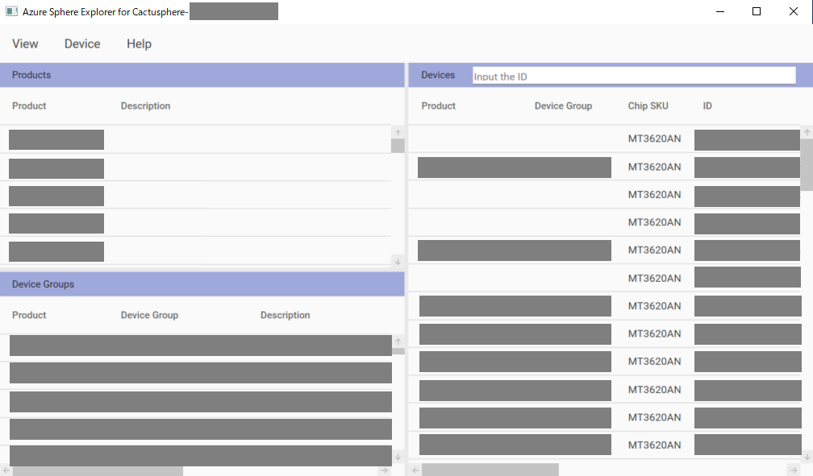</a>

また、ProductかDevice Groupsの一覧上で右クリックし"Extract Devices from [Product/DeviceGroup]"を選択する事で、"ExtractWindow"を表示する事ができます。

<a href="../../Images/AzureSphereExplorer_ExtractWindow_001.png">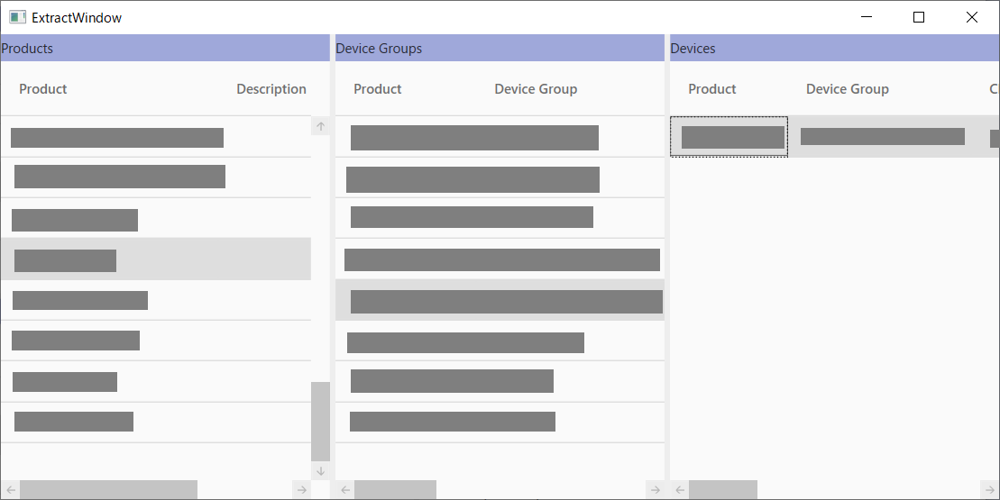</a>

このウィンドウではProduct、Device Groups、Deviceを左から階層表示します。各プロダクトとデバイスグループに紐付いたデバイスの一覧を表示する事ができるため、全体の状態を把握する際に役立ちます。

また、デバイスグループ変更やクレームなどの機能では、デバイスIDが記載されたcsvファイルを読み込む事で一括設定する事も可能です。

### デプロイ機能

Azure Sphere には Azure Sphere アプリケーションを更新するためにデプロイという機能があり、OTA (Over The Air) やイーサネットなどネットワーク経由で Azure Sphere デバイスをまとめて更新することができます。

デプロイについての詳細についてはソフトウェアマニュアルを参照してください。ソフトウェアマニュアルのダウンロードには、Armadilloサイトのユーザー登録とログインが必要になります。

https://armadillo.atmark-techno.com/resources/documents/cactusphere/manuals

### AzureSphereExplorerからデプロイ設定を行う方法

AzureSphereExplorerの"Device Groups"ペインの一覧から、デプロイ設定を行うデバイスグループを選択し、右クリックします。("ExtractWindow"の"Device Groups"からも同じ事ができます。)

<a href="../../Images/AzureSphereExplorer_Deploy_001.png">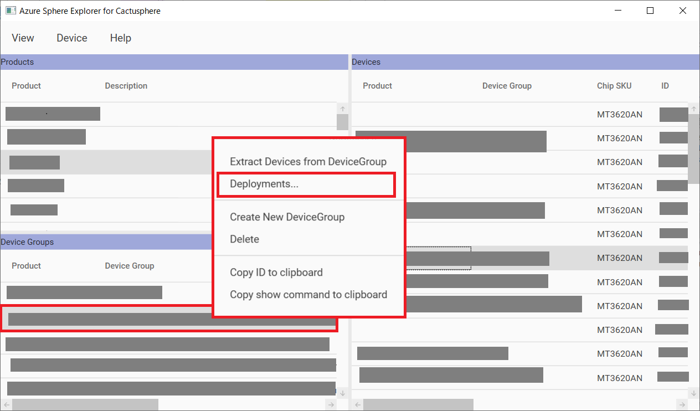</a>

"Deployments..."を選択するとDeploymentsウィンドウが表示されます。

<a href="../../Images/AzureSphereExplorer_Deploy_002.png">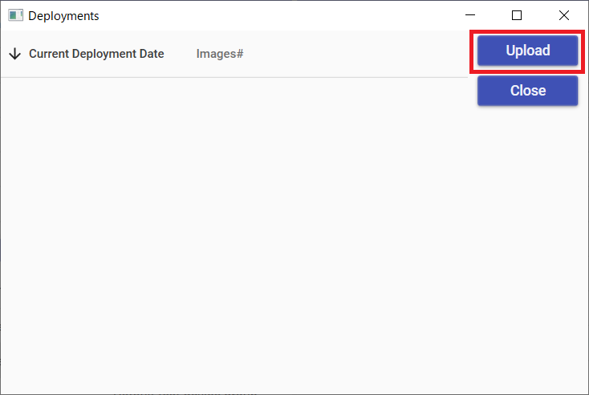</a>

(
    画像の例では"Current Deployment Date"と"Images#"一覧は空ですが、既にデプロイ設定しているデバイスグループでは"Current Deployment Date"と"Images#"に、それぞれデプロイ設定を行った日時と、デプロイ設定を行ったイメージ数が表示されます。
)

"Upload"ボタンを押下すると、"UploadWindow"が表示されます。

<a href="../../Images/AzureSphereExplorer_Deploy_003.png">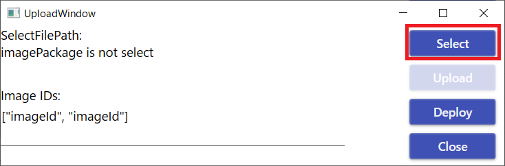</a>

"Select"ボタンを押下してデプロイ設定するイメージを選択します。設定が完了すると、"SelectFilePath:"に選択したファイルのパスが表示されます。

<a href="../../Images/AzureSphereExplorer_Deploy_004.png">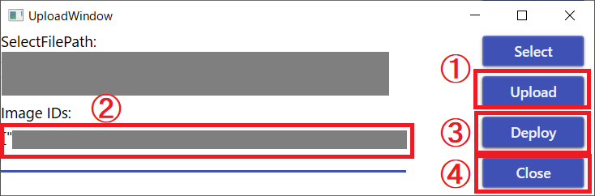</a>

 * ① **Uploadボタン** ：対象をイメージをテナントにアップロードしていない場合は、"Upload"を押下する事で、アップロードを実行できます。既にイメージがアップロードされている場合は"Image is Already Upload."と表示されます。

 * ② **イメージIDの指定** ：テナントにアップロード済みのイメージIDを設定します。",(カンマ)"で区切る事で複数のイメージを指定する事ができます。もし、イメージIDが不明な場合は、"Azure Sphere Developer Command Prompt"から"azsphere image add --filepath [イメージのパス]"コマンドを実行する事で確認できます。詳しくはソフトウェアマニュアルの「4.3.4. Cactusphere ファームウェアを書き込む
」を参照して下さい。

<a href="../../Images/AzureSphereExplorer_Deploy_005.png">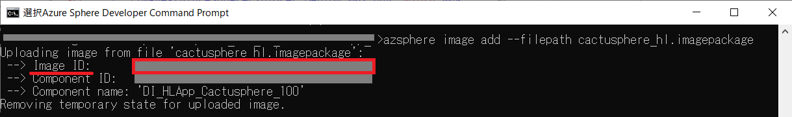</a>

 * ③ **Deployボタン** ：デプロイ設定の準備ができたら"Deploy"を押下します。

 * ④ **Closeボタン** ：デプロイ設定に成功すると"Deployment is success."と記載されたウィンドウが表示されるため"OK"を押下します。その後、"UploadWindow"の"Close"を押下してウィンドウを閉じます。

デプロイ設定が成功している場合、Deploymentsウィンドウの"Current Deployment Date"と"Images#"一覧にデプロイ設定を行った日時と、デプロイ設定を行ったイメージの数が表示されます。

<a href="../../Images/AzureSphereExplorer_Deploy_006.png">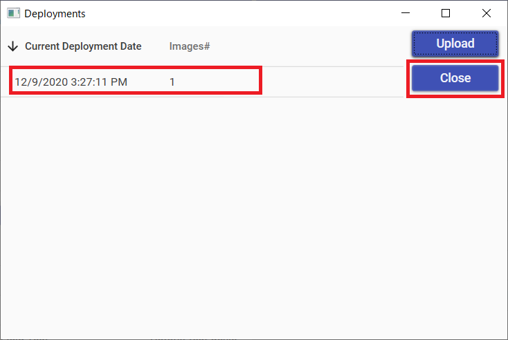</a>

問題が無ければ"Close"を押下してウィンドウを閉じます。

これでデプロイ設定は完了です。

## 追記機能の使い方

### デバイスのクレーム (claim) 機能

Azure Sphere テナントに接続できるようにするためには、Azure Sphere テナントにクレーム作業を行ってテナントにデバイスを紐付ける必要があります。AzureSphereExplorerでは、一度、クレームして Azure Sphere テナントに紐付けられると、紐付けられた Azure Sphere テナントを**変更することはできない**ため、注意して実施して下さい。

クレームについての詳細についてはソフトウェアマニュアルを参照してください。ソフトウェアマニュアルのダウンロードには、Armadilloサイトのユーザー登録とログインが必要になります。

https://armadillo.atmark-techno.com/resources/documents/cactusphere/manuals

### AzureSphereExplorerからデバイスのクレーム (claim) を行う方法

AzureSphereExplorerの"Device"タブから"Claim"を選択すると、"DeviceClaimWindow"が表示されます。

<a href="../../Images/AzureSphereExplorer_DeviceClaimWindow_001.png">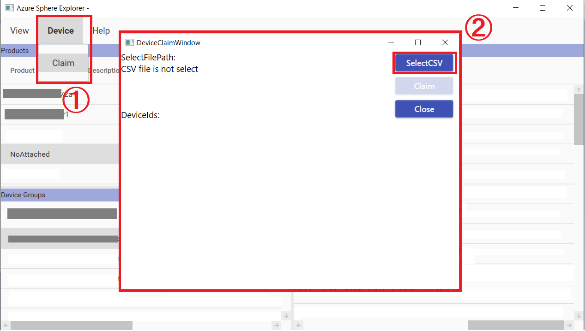</a>

"SelectCSV"ボタンを押下し、ローカルフォルダの中からデバイスIDが書かれたcsvファイルを読み込みます。今回の例ではデバイスIDが一つだけ記載された"cactusphere_device_id_list.csv"という名前のファイルを選択しました。csvファイルの読み込みに成功すると、"SelectFilePath:"にファイルのパスが表示されます。

"Claim"ボタンを押下すると、"Attention"ウィンドウが表示され、クレームをしてよいか確認されます。**一度、クレームして Azure Sphere テナントに紐付けられると、紐付けられた Azure Sphere テナントを変更することはできないため、注意して実施して下さい。**

問題ない場合は、「はい(Y)」ボタンを押下します。

<a href="../../Images/AzureSphereExplorer_DeviceClaimWindow_002.png">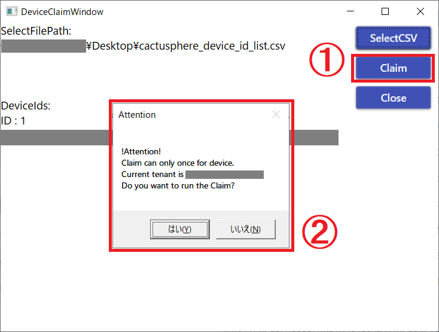</a>

問題なくクレームが実行されると、"Claim is finished."と記載されたウィンドウが表示されます。その際、"DeviceClaimWindow"の"deviceids"の"success"の下に、クレームしたデバイスのデバイスIDが表示されている事を確認します。問題がない場合、"OK"ボタンを押下してウィンドウを閉じます。

<a href="../../Images/AzureSphereExplorer_DeviceClaimWindow_003.png">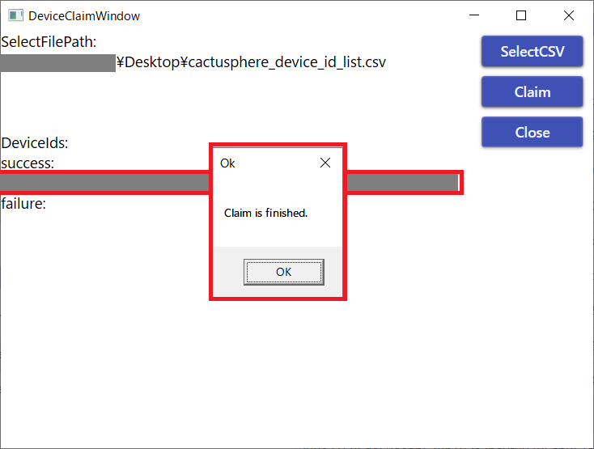</a>

これでデバイスのクレームは完了です。

### SphereOS/アプリのOTA保留/時間指定実行

Cactusphereはアップデート保留機能を有しています。この機能を用いる事で、OSとFWのOTAを遅延させる事ができます。

アップデート保留機能についての詳細についてはソフトウェアマニュアルを参照してください。
ソフトウェアマニュアルのダウンロードには、Armadilloサイトのユーザー登録とログインが必要になります。

https://armadillo.atmark-techno.com/resources/documents/cactusphere/manuals

### AzureSphereExplorerからOTA保留機能を利用する方法

AzureSphereExplorerの"Devices"ペイン内のデバイスID一覧から任意のデバイスを選び、 **右クリック** します。一覧から"Update Properties"を選択します。

<a href="../../Images/AzureSphereExplorer_UpdatePropertiesWindow_001.png">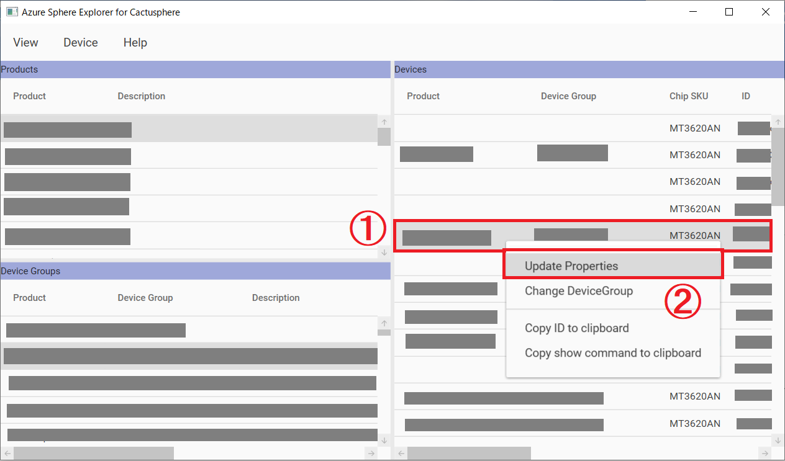</a>

"UpdatePropertiesWindow"が表示されます。アップデート保留機能を利用する際、IoT CentralアプリケーションのURLとAPI トークンの値が必要になります。

<a href="../../Images/AzureSphereExplorer_UpdatePropertiesWindow_002.png">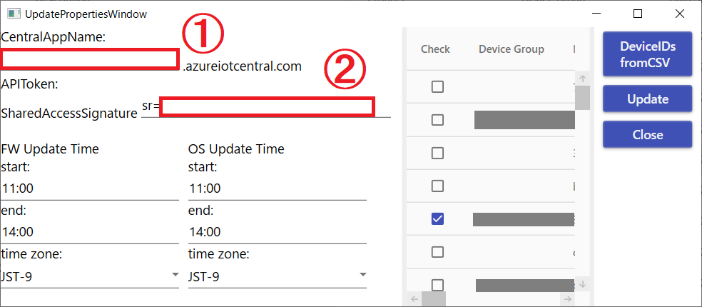</a>

* ①："CentralAppName:"に、IoT CentralアプリケーションのURLを入力します。IoT CentralアプリケーションのURLはIoT Centralの「管理」→「お客様のアプリケーション」→「アプリケーションURL」で確認する事ができます。

<a href="../../Images/AzureSphereExplorer_UpdatePropertiesWindow_003.png">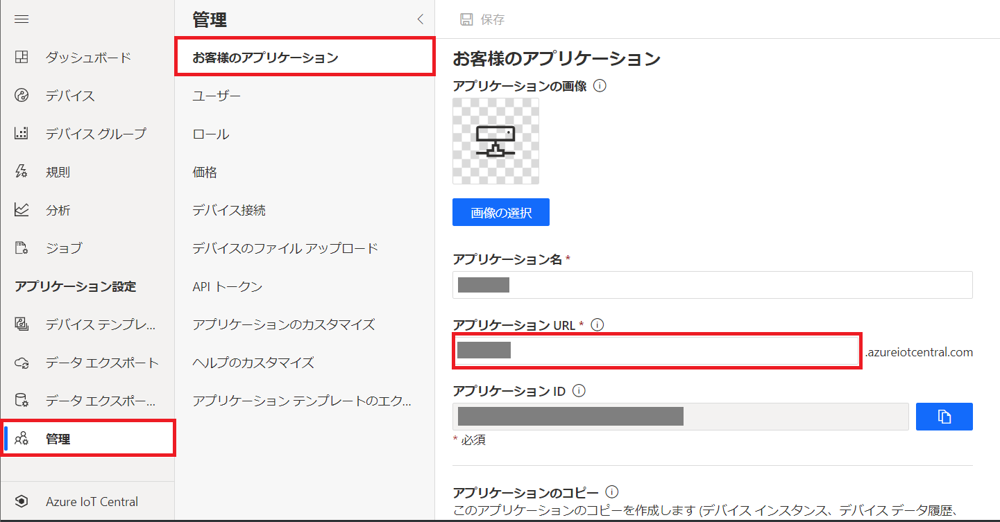</a>

* ②："APIToken:"に、API トークンを入力します。API トークンはIoT Centralの「管理」→「API トークン」→「トークンの生成」で生成した際に表示される値です。（"sr="より後の数値を入れて下さい）API トークンは一度しか表示されないため、既に表示させてAPIトークンの値が不明な場合は、もう一度任意の名前でAPIトークンを作成し、その値を設定して下さい。

<a href="../../Images/AzureSphereExplorer_UpdatePropertiesWindow_004.png">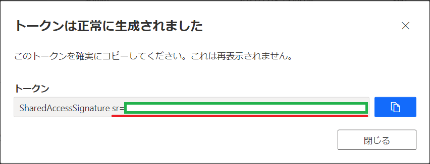</a>

"FW Update Time"にはファームウェア、"OS Update Time"にはOSをアップデートする時間を設定する事ができます。

<a href="../../Images/AzureSphereExplorer_UpdatePropertiesWindow_005.png">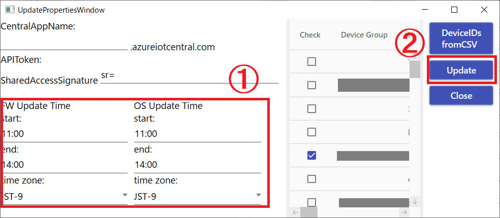</a>

この際、startの時間とendの時間を同じにすることはできませんので、注意が必要です。

"Update"ボタンを押下して、アップデート保留機能を設定します。
"OK"と表記されたウィンドウが表示された場合、アップデート保留機能の設定に成功しています。

これで、アップデート保留機能の設定は完了です。