# Azure Sphere Explorer for Cactusphere

Azure Sphere Explorer for Cactusphereは、Cactusphere用のデバイス管理ツールです。
デバイスやプロダクト、デバイスグループなどをすばやく簡単に確認することができます。

[Azure Sphere Explorer](https://github.com/matsujirushi/AzureSphereExplorer)をベースに、以下の機能が追加されています。

## 追記機能

- デバイスのクレーム (claim) 機能
- SphereOS/アプリのOTA保留/時間指定実行機能
- デバイスピックアップ機能

## ソフトウェアライセンス

 - Azure Sphere Explorer(ベースソフトウェア)
    - [MIT License](https://github.com/matsujirushi/AzureSphereExplorer/blob/master/LICENSE.txt)

 - Azure Sphere Explorer for Cactusphere(本ツール)
    - [MIT License](https://github.com/Cactusphere/Cactusphere-100/blob/master/Tools/AzureSphereExplorerForCactusphere/LICENSE.txt)

## 更新履歴

 - [詳細](UPDATE_HISTORY.md)

## 要件

### サポートしているプラットフォーム

* Microsoft Windows 10 (.NET Framework 4.8)
* Microsoft Windows 10 (.NET 5)

## インストール方法

1. [AzureSphereExplorerForCactusphere.zip](https://github.com/Cactusphere/Cactusphere-100/raw/master/Tools/AzureSphereExplorerForCactusphere/AzureSphereExplorerForCactusphere.zip)をダウンロードしてください。
1. 任意のフォルダに、`AzureSphereExplorerForCactusphere.zip`を解凍してください。
1. 解凍されたフォルダ内の、`AzureSphereExplorerForCactusphere.exe`を起動してください。

## 基本機能について

### サインイン

`AzureSphereExplorerForCactusphere.exe`を起動すると、サインインウインドウが表示されます。Azure Sphere 用のアカウントでサインインしてください。サインインに成功すると紐づけられているテナント名が上部の`Azure Sphere Explorer For Cactusphere-`に続いて表示されます。紐づけられているテナントが複数ある場合は表示したいテナントを選択するウィンドウが表示されますので、テナントを選択してください。

### メインウインドウ

Azure Sphere Explorer for Cactusphereには3つのペイン(表示領域)があります。左ペインにProductとDevice Groupsの一覧が表示され、右ペインにはDevice一覧が表示されます。各項目の上で右クリックをすることで、項目の作成や削除、デプロイ設定、デバイスグループの変更などを行う事ができます。

<a href="../../Images/AzureSphereExplorer_MainWindow_001.png">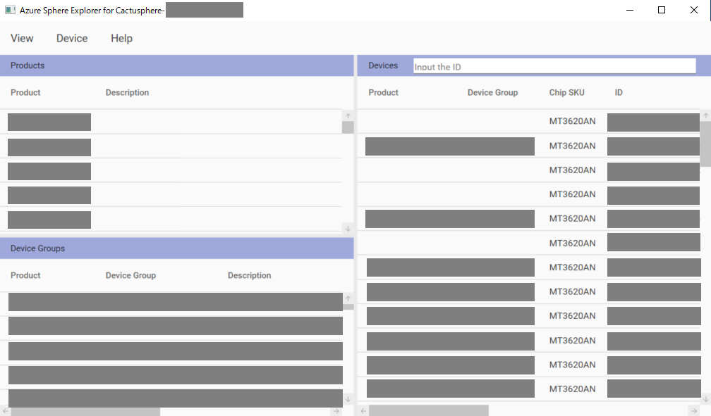</a>

また、ProductかDevice Groupsの一覧上で右クリックし"Extract Devices from [Product/DeviceGroup]"を選択する事で、"ExtractWindow"を表示する事ができます。

<a href="../../Images/AzureSphereExplorer_ExtractWindow_001.png">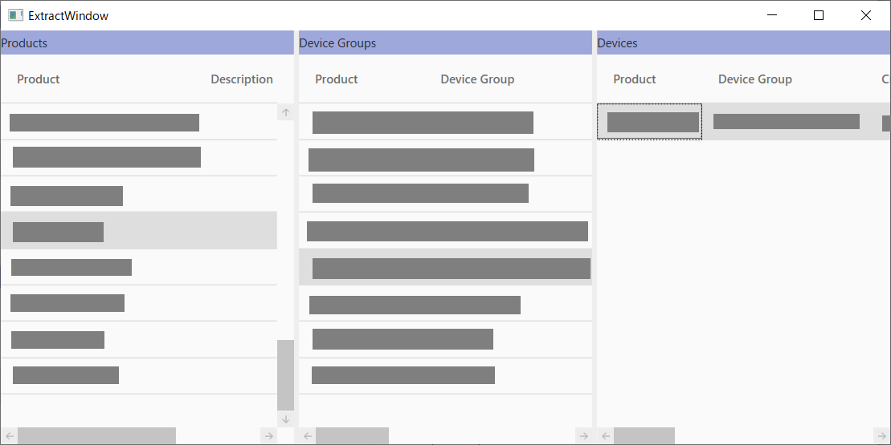</a>

このウィンドウではProduct、Device Groups、Deviceを左から階層表示します。各プロダクトとデバイスグループに紐付いたデバイスの一覧を表示する事ができるため、全体の状態を把握する際に役立ちます。

また、デバイスグループ変更やクレームなどの機能では、デバイスIDが記載されたcsvファイルを読み込む事で一括設定する事も可能です。

### Azure Sphere Explorer for Cactusphereからプロダクトの作成を行う方法

Azure Sphere Explorer for Cactusphereの"Products"ペインの一覧で右クリックします。

"Create New Product"を選択するとCreateProductWindowが表示されます。

 * ① **プロダクト名の指定** ：作成するプロダクトの名前を指定する事ができます。

 * ② **デフォルトグループの有効** ：プロダクトを作成する場合、デバイスグループのテンプレートが作成されます。デバイスグループの作成が不要な場合は"No"を指定します。

 * ③ **説明文** ：作成するプロダクトに関しての説明文を記載する事ができます。空白の状態で作成する事も可能です。

 * ④ **Createボタン** ：各設定を行った後、Createボタンを押下する事で、プロダクトを作成する事ができます。プロダクトの作成が成功すると、"Create Product is success."と記載されたウィンドウが表示されるため"OK"を押下します。

 * ⑤ **Closeボタン** ：Closeボタンを押下してウィンドウを閉じます。

### Azure Sphere Explorer for Cactusphereからデバイスグループの作成を行う方法

Azure Sphere Explorer for Cactusphereの"Device Groups"ペインの一覧で右クリックします。

"Create New DeviceGroup"を選択するとCreateDeviceGroupWindowが表示されます。

 * ① **デバイスグループ名の指定** ：作成するデバイスグループの名前を指定する事ができます。

 * ② **プロダクトの指定** ：作成するデバイスグループが所属するプロダクトの名前を指定します。右にある"▼"を押下すると、現在作成されているプロダクト名の一覧が表示されます。

 * ③ **説明文** ：作成するデバイスグループに関しての説明文を記載する事ができます。空白の状態で作成する事も可能です。

 * ④ **フィードの指定** ：フィードの指定をする事ができます。右にある"▼"を押下すると、以下の2種類が表示されます。
    * **Retail** ：安定版のシステムソフトウェアで、 機能リリース、品質リリースでフィードされます。
    * **RetailEval** ：評価版のシステムソフトウェアで、Retail OS フィードの２週前にフィードされます。

 * ⑤ **アップデートポリシーの設定** ：作成するデバイスグループのアップデートポリシーを指定する事ができます。これは、OSやファームウェアのアップデートを行う際に、どの範囲でアップデートするかを指定する値です。右にある"▼"を押下すると、以下の2種類が表示されます。
    * **UpdateAll** ：OS/HLApp/RTApp/ボード構成パッケージを含む全てのファームウェアをアップデートします。
    * **No3rdPartyAppUpdates** ：OSのみアップデートします。

 * ⑥ **Createボタン** ：各設定を行った後、Createボタンを押下する事で、デバイスグループを作成する事ができます。デバイスグループの作成が成功すると、"Create DeviceGroup is success."と記載されたウィンドウが表示されるため"OK"を押下します。

 * ⑦ **Closeボタン** ：Closeボタンを押下してウィンドウを閉じます。

### Azure Sphere Explorer for Cactusphereからデバイスグループの変更を行う方法

Azure Sphere Explorer for Cactusphereの"Devices"ペインの一覧で、デバイスグループを変更したいデバイスを選択し、右クリックします。

"Change DeviceGroup"を選択するとChangeDeviceGroupWindowが表示されます。

 * ① **変更先のデバイスグループの指定** ：変更先のデバイスグループを指定します。右にある"▼"を押下すると、変更先のデバイスグループが[プロダクト名/デバイスグループ名]の形式で一覧表示されます。

 * ② **デバイスの指定** ：変更元のデバイスを指定します。デフォルトでは、ChangeDeviceGroupWindowを表示した際に選択したデバイスにチェックが入っています。デバイス一覧の左にある"□"にチェックを入れる事で、複数のデバイスを一度に一つのデバイスグループへ変更する事も可能です。

 * ③ **CSVファイル読み込みボタン** ：CSVファイルに記載されたデバイスIDを読み込む事で、複数のデバイスを選択する事ができます。
    * ※CSVファイルは、デバイスID毎に改行を入れて作成して下さい。

 * ④ **デバイスグループ変更ボタン** ：各設定を行った後、Changeボタンを押下する事で、デバイスグループを変更する事ができます。デバイスグループの変更が成功すると、②で選択したデバイスの"Device Group"の値が変更されます。

 * ⑤ **Closeボタン** ：Closeボタンを押下してウィンドウを閉じます。

### Azure Sphere Explorer for Cactusphereからプロダクトを削除する方法

Azure Sphere Explorer for Cactusphereの"Products"ペインの一覧で、削除したい項目を選択し、右クリックします。

<a href="../../Images/AzureSphereExplorer_DeletePrd_001.png">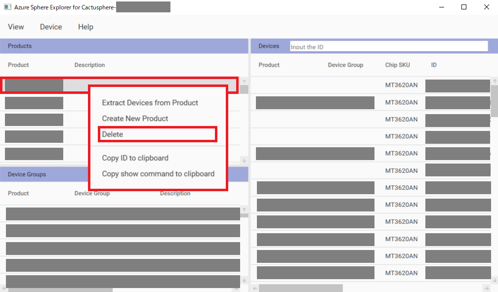</a>

"Delete"を選択すると確認ウィンドウが表示されるため、"OK"ボタンを押下する事でプロダクトを削除する事ができます。プロダクトの削除が成功すると、"Product delete is success."と記載されたウィンドウが表示されるため"OK"を押下します。

### Azure Sphere Explorer for Cactusphereからデバイスグループを削除する方法

Azure Sphere Explorer for Cactusphereの"Device Groups"ペインの一覧で、削除したい項目を選択し、右クリックします。

"Delete"を選択すると確認ウィンドウが表示されるため、"OK"ボタンを押下する事でデバイスグループを削除する事ができます。デバイスグループの削除が成功すると、"DeviceGroup delete is success."と記載されたウィンドウが表示されるため"OK"を押下します。

### デプロイ機能

Azure Sphere には Azure Sphere アプリケーションを更新するためにデプロイという機能があり、OTA (Over The Air) やイーサネットなどネットワーク経由で Azure Sphere デバイスをまとめて更新することができます。

デプロイについての詳細についてはソフトウェアマニュアルを参照してください。ソフトウェアマニュアルのダウンロードには、Armadilloサイトのユーザー登録とログインが必要になります。

https://armadillo.atmark-techno.com/resources/documents/cactusphere/manuals

### Azure Sphere Explorer for Cactusphereからデプロイ設定を行う方法

Azure Sphere Explorer for Cactusphereの"Device Groups"ペインの一覧から、デプロイ設定を行うデバイスグループを選択し、右クリックします。("ExtractWindow"の"Device Groups"からも同じ事ができます。)

<a href="../../Images/AzureSphereExplorer_Deploy_001.png">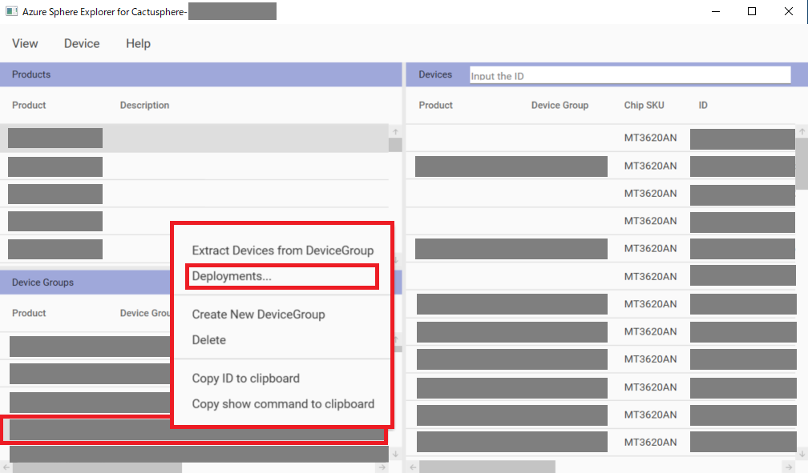</a>

"Deployments..."を選択するとDeploymentsウィンドウが表示されます。

<a href="../../Images/AzureSphereExplorer_Deploy_002.png">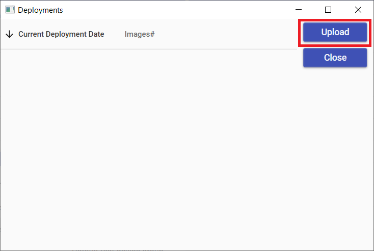</a>

(
    画像の例では"Current Deployment Date"と"Images#"一覧は空ですが、既にデプロイ設定しているデバイスグループでは"Current Deployment Date"と"Images#"に、それぞれデプロイ設定を行った日時と、デプロイ設定を行ったイメージ数が表示されます。
)

"Upload"ボタンを押下すると、"UploadWindow"が表示されます。

<a href="../../Images/AzureSphereExplorer_Deploy_003.png">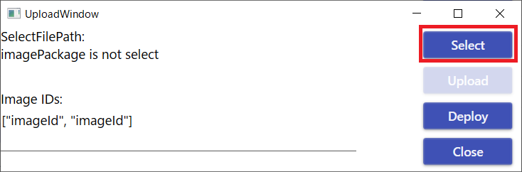</a>

"Select"ボタンを押下してデプロイ設定するイメージを選択します。設定が完了すると、"SelectFilePath:"に選択したファイルのパスが表示されます。

<a href="../../Images/AzureSphereExplorer_Deploy_004.png">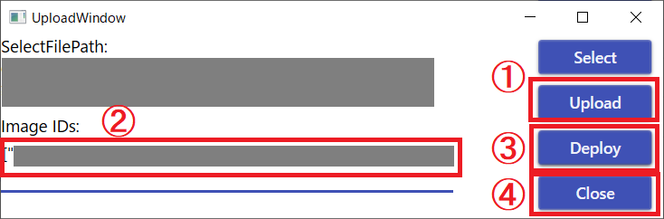</a>

 * ① **Uploadボタン** ：対象をイメージをテナントにアップロードしていない場合は、"Upload"を押下する事で、アップロードを実行できます。既にイメージがアップロードされている場合は"Image is Already Upload."と表示されます。

 * ② **イメージIDの指定** ：テナントにアップロード済みのイメージIDを設定します。",(カンマ)"で区切る事で複数のイメージを指定する事ができます。もし、イメージIDが不明な場合は、"Azure Sphere Developer Command Prompt"から"azsphere image add --filepath [イメージのパス]"コマンドを実行する事で確認できます。詳しくはソフトウェアマニュアルの「4.3.4. Cactusphere ファームウェアを書き込む
」を参照して下さい。

<a href="../../Images/AzureSphereExplorer_Deploy_005.png">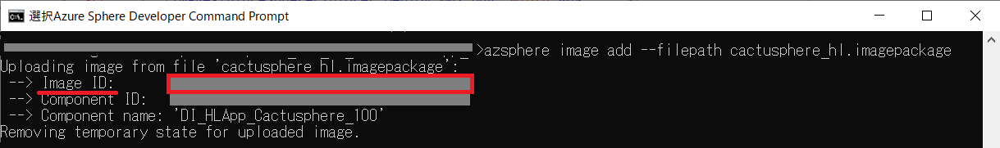</a>

 * ③ **Deployボタン** ：デプロイ設定の準備ができたら"Deploy"を押下します。

 * ④ **Closeボタン** ：デプロイ設定に成功すると"Deployment is success."と記載されたウィンドウが表示されるため"OK"を押下します。その後、"UploadWindow"の"Close"を押下してウィンドウを閉じます。

デプロイ設定が成功している場合、Deploymentsウィンドウの"Current Deployment Date"と"Images#"一覧にデプロイ設定を行った日時と、デプロイ設定を行ったイメージの数が表示されます。

<a href="../../Images/AzureSphereExplorer_Deploy_006.png">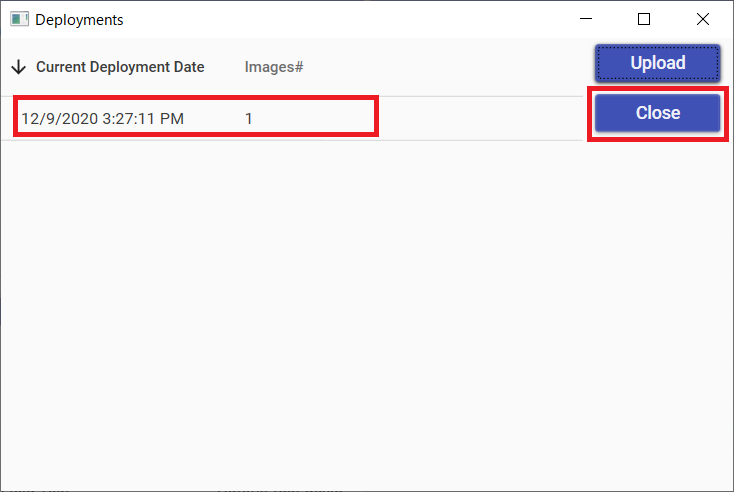</a>

問題が無ければCloseボタンを押下してウィンドウを閉じます。

これでデプロイ設定は完了です。

## 追記機能の使い方

### デバイスのクレーム (claim) 機能

Azure Sphere テナントに接続できるようにするためには、Azure Sphere テナントにクレーム作業を行ってテナントにデバイスを紐付ける必要があります。Azure Sphere Explorer for Cactusphereでは、一度、クレームして Azure Sphere テナントに紐付けられると、紐付けられた Azure Sphere テナントを**変更することはできない**ため、注意して実施して下さい。

クレームについての詳細についてはソフトウェアマニュアルを参照してください。ソフトウェアマニュアルのダウンロードには、Armadilloサイトのユーザー登録とログインが必要になります。

https://armadillo.atmark-techno.com/resources/documents/cactusphere/manuals

### Azure Sphere Explorer for Cactusphereからデバイスのクレーム (claim) を行う方法

Azure Sphere Explorer for Cactusphereの"Device"タブから"Claim"を選択すると、"DeviceClaimWindow"が表示されます。

"SelectCSV"ボタンを押下し、ローカルフォルダの中からデバイスIDが書かれたcsvファイルを読み込みます。今回の例ではデバイスIDが一つだけ記載された"cactusphere_device_id_list.csv"という名前のファイルを選択しました。csvファイルの読み込みに成功すると、"SelectFilePath:"にファイルのパスが表示されます。

"Claim"ボタンを押下すると、"Attention"ウィンドウが表示され、クレームをしてよいか確認されます。**一度、クレームして Azure Sphere テナントに紐付けられると、紐付けられた Azure Sphere テナントを変更することはできないため、注意して実施して下さい。**

問題ない場合は、「はい(Y)」ボタンを押下します。

問題なくクレームが実行されると、"Claim is finished."と記載されたウィンドウが表示されます。その際、"DeviceClaimWindow"の"deviceids"の"success"の下に、クレームしたデバイスのデバイスIDが表示されている事を確認します。問題がない場合、"OK"ボタンを押下してウィンドウを閉じます。

これでデバイスのクレームは完了です。

### SphereOS/アプリのOTA保留/時間指定実行

Cactusphereはアップデート保留機能を有しています。この機能を用いる事で、OSとFWのOTAを遅延させる事ができます。

アップデート保留機能についての詳細についてはソフトウェアマニュアルを参照してください。
ソフトウェアマニュアルのダウンロードには、Armadilloサイトのユーザー登録とログインが必要になります。

https://armadillo.atmark-techno.com/resources/documents/cactusphere/manuals

### Azure Sphere Explorer for CactusphereからOTA保留機能を利用する方法

Azure Sphere Explorer for Cactusphereの"Devices"ペイン内のデバイスID一覧から任意のデバイスを選び、 **右クリック** します。一覧から"Update Properties"を選択します。

"UpdatePropertiesWindow"が表示されます。アップデート保留機能を利用する際、IoT CentralアプリケーションのURLとAPI トークンの値が必要になります。

<a href="../../Images/AzureSphereExplorer_UpdatePropertiesWindow_002.png">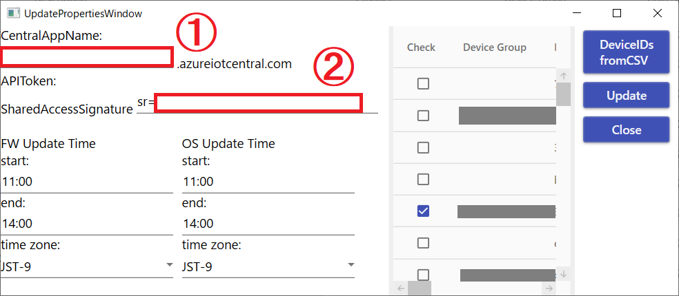</a>

* ①："CentralAppName:"に、IoT CentralアプリケーションのURLを入力します。IoT CentralアプリケーションのURLはIoT Centralの「管理」→「お客様のアプリケーション」→「アプリケーションURL」で確認する事ができます。

* ②："APIToken:"に、API トークンを入力します。API トークンはIoT Centralの「管理」→「API トークン」→「トークンの生成」で生成した際に表示される値です。（"sr="より後の数値を入れて下さい）API トークンは一度しか表示されないため、既に表示させてAPIトークンの値が不明な場合は、もう一度任意の名前でAPIトークンを作成し、その値を設定して下さい。

"FW Update Time"にはファームウェア、"OS Update Time"にはOSをアップデートする時間を設定する事ができます。

<a href="../../Images/AzureSphereExplorer_UpdatePropertiesWindow_005.png">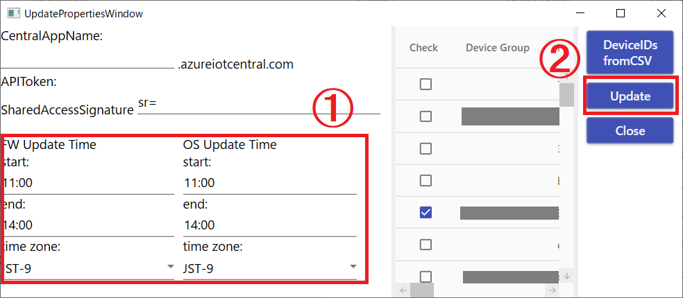</a>

この際、startの時間とendの時間を同じにすることはできませんので、注意が必要です。

"Update"ボタンを押下して、アップデート保留機能を設定します。
"OK"と表記されたウィンドウが表示された場合、アップデート保留機能の設定に成功しています。

これで、アップデート保留機能の設定は完了です。

### デバイスピックアップ機能

"Devices"ペイン上部にある"Input the ID"フォームにデバイスIDを入力すると、一致するデバイスのみ一覧に表示されます。

一致するデバイスが一つもない場合は、一覧は更新されません。